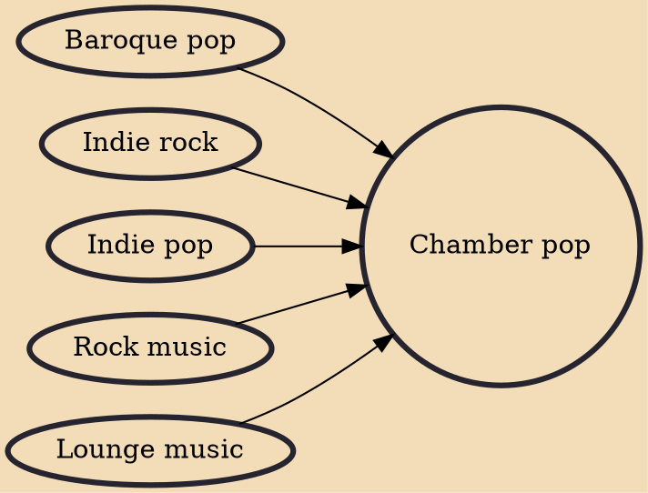

Chamber pop (also called baroque pop and sometimes conflated with orchestral pop or symphonic pop) is a music genre that combines rock music with the intricate use of strings, horns, piano, and vocal harmonies, and other components drawn from the orchestral and lounge pop of the 1960s, with an emphasis on melody and texture.

## Influences

- [[Baroque pop]]
- [[Indie rock]]
- [[Indie pop]]
- [[Rock music]]
- [[Lounge music]]
