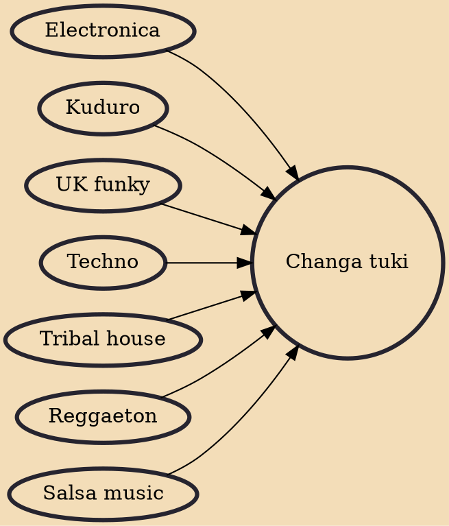

Changa tuki (also known as Raptor house) is a life-style, dance and music genre derived from electronic music that originated in Caracas, Venezuela in early-1990s and it was a strong trend and present in parties until the late-2000s. The Changa culture was a big mainstream between the people of Venezuela along with other genres such as reggaeton, salsa, and emo. Its dancers and supporters are known as tuki(s). The dance of it is a style of ghetto dance. The most famous meeting place in Caracas where the tuki music was danced and there were good DJs of the genre was Adrena.

## Influences
- [[Electronica]]
- [[Kuduro]]
- [[UK funky]]
- [[Techno]]
- [[Tribal house]]
- [[Reggaeton]]
- [[Salsa music]]
