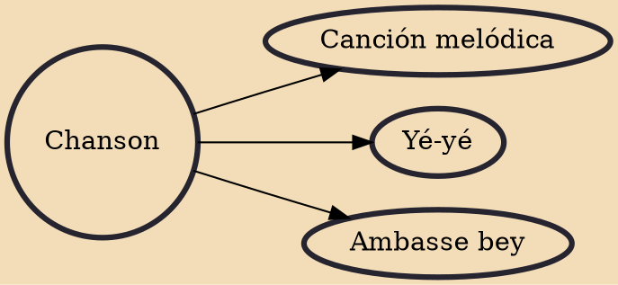

A chanson (UK: /ˈʃɒ̃sɒ̃/, US: /ʃɑːnˈsɔːn/, French: chanson française, [ʃɑ̃sɔ̃ fʁɑ̃sɛz]; lit. 'French song') is generally any lyric-driven French song, though it most often refers to the secular polyphonic French songs of late medieval and Renaissance music. The genre had origins in the monophonic songs of troubadours and trouvères, though the only polyphonic precedents were 16 works by Adam de la Halle and one by Jehan de Lescurel. Not until the ars nova composer Guillaume de Machaut did any composer write a significant number of polyphonic chansons.

## Derivatives

- [[Canción melódica]]
- [[Yé-yé]]
- [[Ambasse bey]]
