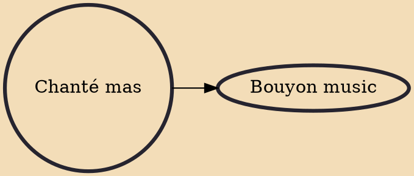

Chanté mas (masquerade song) and Lapo kabrit is a form of Carnival music of Dominica. It is performed by masquerading partygoers in a two-day parade, with a lead vocalist (chantwèl), who is followed by the responsorial chorus (lavwa), with drummers and dancers dancing backwards in front of the drummer on a tambou lélé. The Carnival has African and French roots and is otherwise known as Mas Dominik, the most original Carnival in the Caribbean.

## Derivatives
- [[Bouyon music]]
