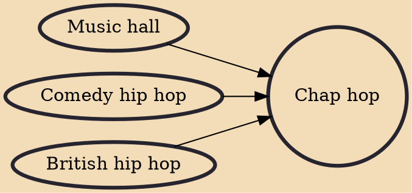

Chap hop is music originating from England that mixes the hip hop genre with elements from the Chappist or steampunk subcultures and stereotypical English obsessions such as cricket, tea, and the weather. Two leading exponents of the genre are Professor Elemental and Mr.B The Gentleman Rhymer. Other names include Madam Misfit, Poplock Holmes & DJ WattsOn.

## Influences

- [[Music hall]]
- [[Comedy hip hop]]
- [[British hip hop]]
