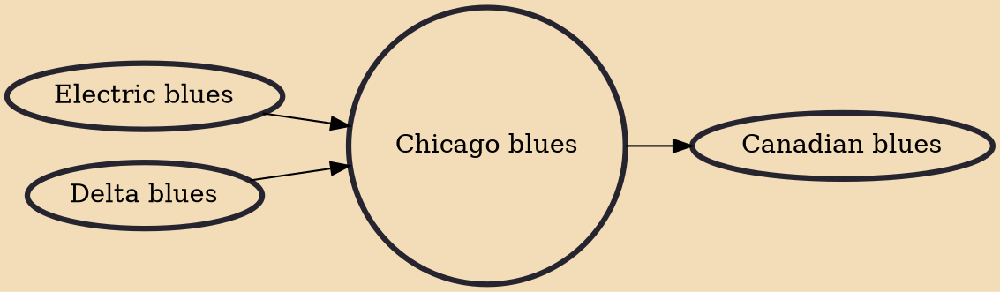

Chicago blues is a form of blues music developed in Chicago, Illinois. It is based on earlier blues idioms, such as Delta blues, but performed in an urban style. It developed alongside the Great Migration of the first half of the twentieth century. Key features that distinguish Chicago blues from the earlier traditions, such as the Delta blues, is the prominent use of electrified instruments, especially the electric guitar, and especially the use of electronic effects such as distortion and overdrive.

## Influences
- [[Electric blues]]
- [[Delta blues]]

## Derivatives
- [[Canadian blues]]
