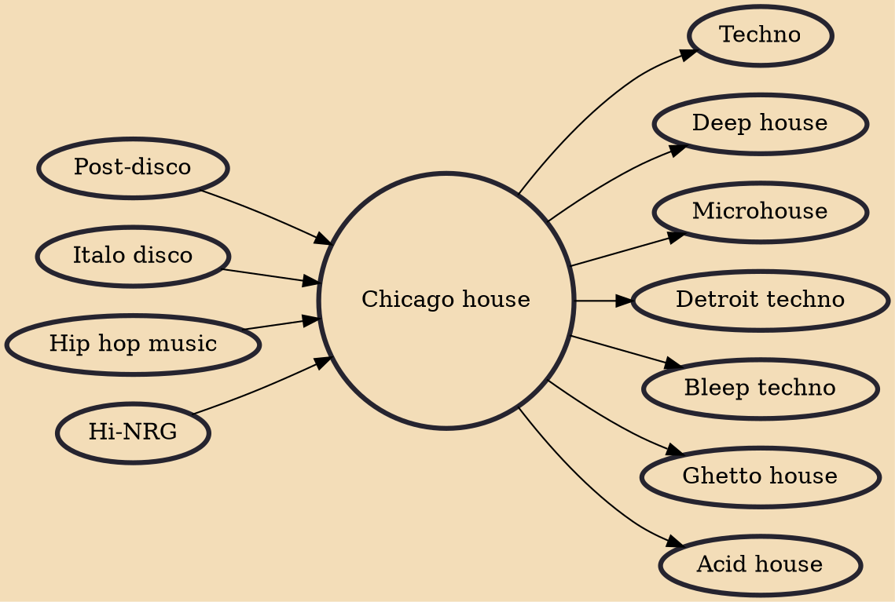

Chicago house refers to house music produced during the mid to late 1980s within Chicago. The term is generally used to refer to the first ever house music productions, which were by Chicago-based artists in the 1980s.

## Influences
- [[Post-disco]]
- [[Italo disco]]
- [[Hip hop music]]
- [[Hi-NRG]]

## Derivatives
- [[Techno]]
- [[Deep house]]
- [[Microhouse]]
- [[Detroit techno]]
- [[Bleep techno]]
- [[Ghetto house]]
- [[Acid house]]
