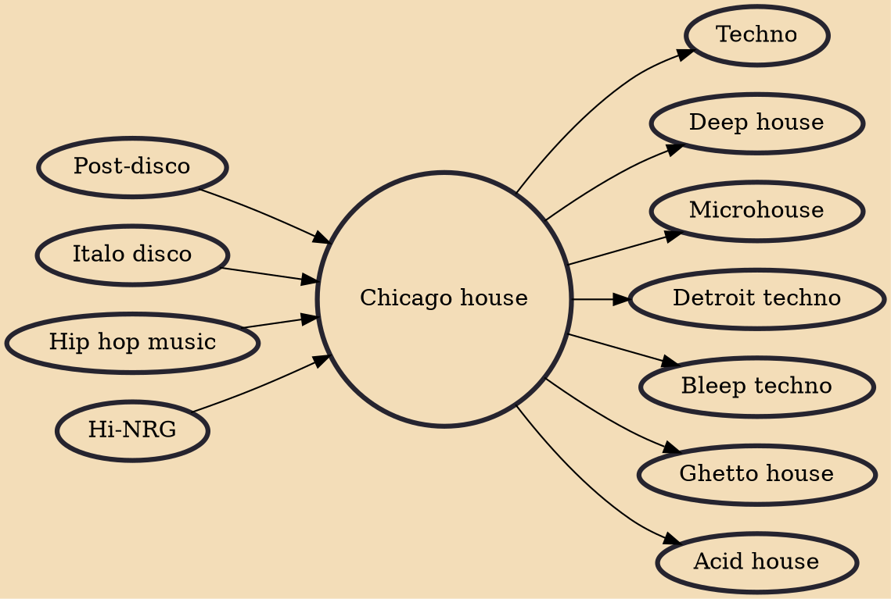

In the midst of post-disco and burgeoning electronic scenes, a group of innovative DJs and producers in Chicago began experimenting with a fusion of disco, soul, funk, and electronic elements. This experimentation led to the creation of a sound that was deeply rooted in rhythm, characterised by its hypnotic beats and uplifting melodies.

The industrial landscapes of Chicago provided inspiration for early Chicago house musicians who were drawn to the starkness of the city's buildings and factories. This influence can be seen in the minimalist approach taken by these artists who stripped down disco and soul samples to create a new sound that was raw, edgy, and above all danceable.

## Key Characteristics

Chicago House boasts several distinctive features that set it apart from other genres:

1. 4/4 Beats: The genre is defined by its consistent 4/4 beat, which provides a solid foundation for dance. This regular rhythm quickly became a staple in Chicago House music and contributed to its dance floor appeal.
2. Soulful Vocals: Chicago House often incorporates soulful and gospel-inspired vocals, infusing the music with a deep emotional resonance. These vocals serve as a vehicle for storytelling and connection.
3. Sampling and Remixing: Chicago House producers were pioneers in the art of sampling and remixing, reimagining existing tracks and sounds to create something entirely new. This innovative approach helped shape the genre's evolving sound.
4. Drum Machines and Synthesizers: Early Chicago House music heavily relied on drum machines and synthesizers, which allowed for the creation of unique and electronic-driven soundscapes.
5. Underground Origins: The genre was born in the underground clubs of Chicago, where DJs and artists would experiment and collaborate, fostering a sense of community and creativity.

## Artists and Tracks

1. [Frankie Knuckles](https://amzn.to/3YTo1vD) - "Your Love": Known as the "Godfather of House Music," Frankie Knuckles' "Your Love" (1987) is a timeless classic that encapsulates the soulful, rhythmic essence of Chicago House.
2. [Marshall Jefferson](https://amzn.to/44upQjK) - "Move Your Body": Marshall Jefferson's "Move Your Body" (1986) is an anthem that exemplifies the genre's infectious beats and uplifting spirit, encouraging listeners to dance and celebrate.
3. [Mr. Fingers](https://amzn.to/3Pgb9fV) - "Can You Feel It": A true masterpiece by Larry Heard (Mr. Fingers), "Can You Feel It" (1986) is a sonic journey that captures the emotional depth and creative innovation of Chicago House.
4. [Ten City](https://amzn.to/3YTxNhk) - "Devotion": With its powerful vocals and dynamic arrangement, Ten City's "Devotion" (1987) showcases the genre's ability to inspire and uplift through music.
5. [Inner City](https://amzn.to/484lDGT) - "Big Fun": Inner City's "Big Fun" (1988) seamlessly blends soulful vocals with electronic elements, creating an irresistible dance floor anthem.
6. [Farley Jackmaster Funk](https://amzn.to/45Oy5bQ) - "Love Can't Turn Around": Featuring the vocals of Darryl Pandy, this track (1986) is a perfect example of Chicago House's ability to fuse electronic sounds with heartfelt vocals.

## Influences

- [[Post-disco]]
- [[Italo disco]]
- [[Hip hop music]]
- [[Hi-NRG]]

## Derivatives

- [[Techno]]
- [[Deep house]]
- [[Microhouse]]
- [[Detroit techno]]
- [[Bleep techno]]
- [[Ghetto house]]
- [[Acid house]]
