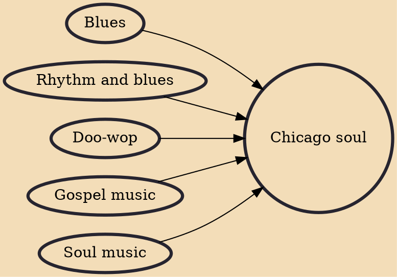

Chicago soul is a style of soul music that arose during the 1960s in Chicago. Along with Detroit, the home of Motown, and Memphis, with its hard-edged, gritty performers (see Memphis soul), Chicago and the Chicago soul style helped spur the album-oriented soul revolution of the early 1970s.

## Influences

- [[Blues]]
- [[Rhythm and blues]]
- [[Doo-wop]]
- [[Gospel music]]
- [[Soul music]]
