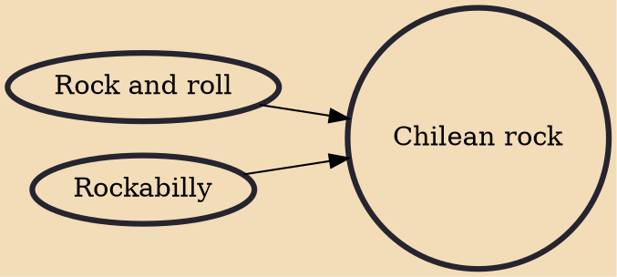

Chilean rock is rock music and its corresponding subgenres produced in Chile or by Chileans. Chilean rock lyrics are usually sung in Spanish so can be considered as part of rock en español, although sometimes are sung in English as well. Rock music was first produced in Chile in the late 1950s by bands that imitated, and sometimes translated, international rock and roll hits from the U.S. This movement was known as the Nueva Ola (New Wave). Although original bands started to emerge as well in the early 1960s.

## Influences

- [[Rock and roll]]
- [[Rockabilly]]
