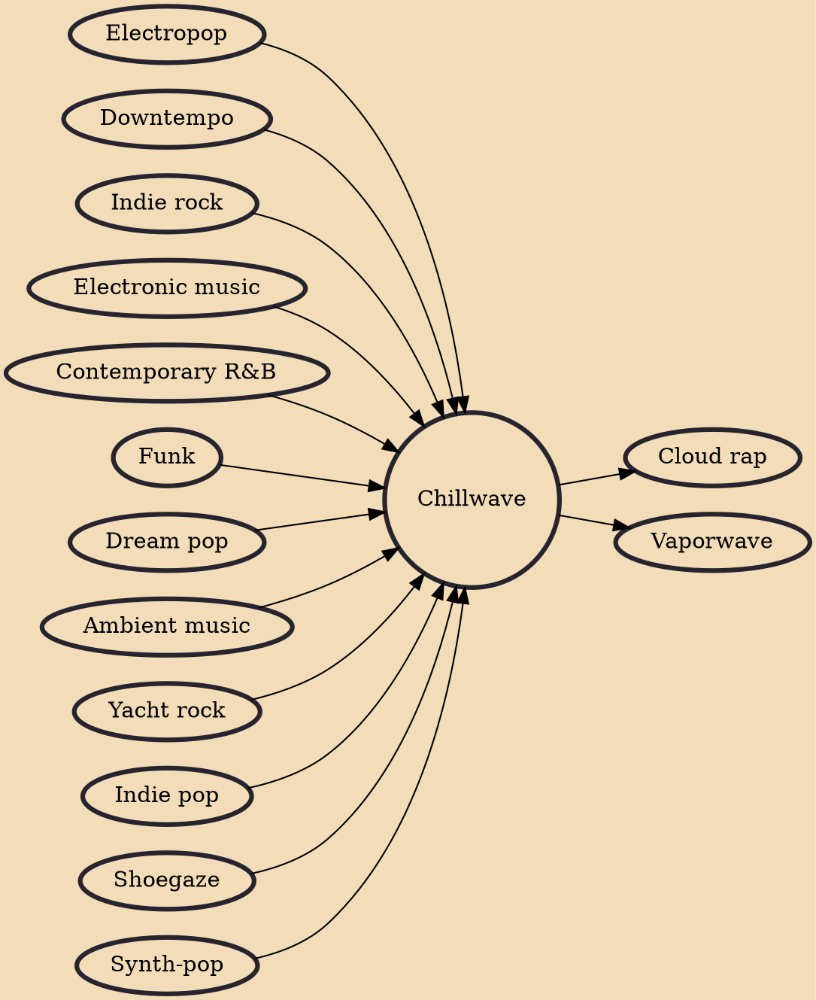

Chillwave (originally considered synonymous with glo-fi and hypnagogic pop) is a music microgenre that emerged in the late 2000s. It loosely emulates 1980s electropop while engaging with notions of memory and nostalgia. Common features include a faded or dreamy retro pop sound, escapist lyrics (frequent topics include the beach or summer), psychedelic or lo-fi aesthetics, mellow vocals, slow-to-moderate tempos, effects processing (especially reverb), and vintage synthesizers.

## Influences

- [[Electropop]]
- [[Downtempo]]
- [[Indie rock]]
- [[Electronic music]]
- [[Contemporary R&B]]
- [[Funk]]
- [[Dream pop]]
- [[Ambient music]]
- [[Yacht rock]]
- [[Indie pop]]
- [[Shoegaze]]
- [[Synth-pop]]

## Derivatives

- [[Cloud rap]]
- [[Vaporwave]]
