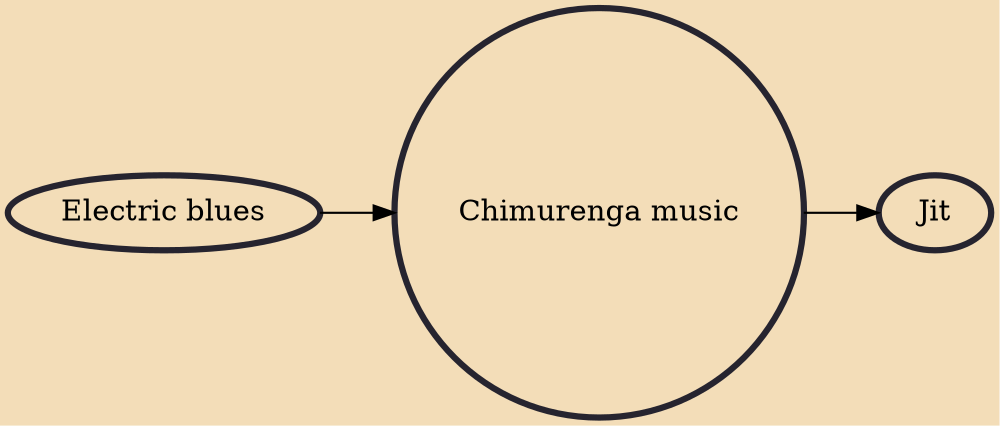

Chimurenga music is a Zimbabwean popular music genre coined and popularized by Thomas Mapfumo. Chimurenga is a Shona language word for liberation, which entered common usage during the Rhodesian Bush War. The word's modern interpretation has been extended to describe a struggle for human rights, political dignity and social justice. Mapfumo developed a style of music based on traditional Shona mbira music, but played with modern electric instrumentation, with lyrics characterized by social and political commentary.

## Influences

- [[Electric blues]]

## Derivatives

- [[Jit]]
