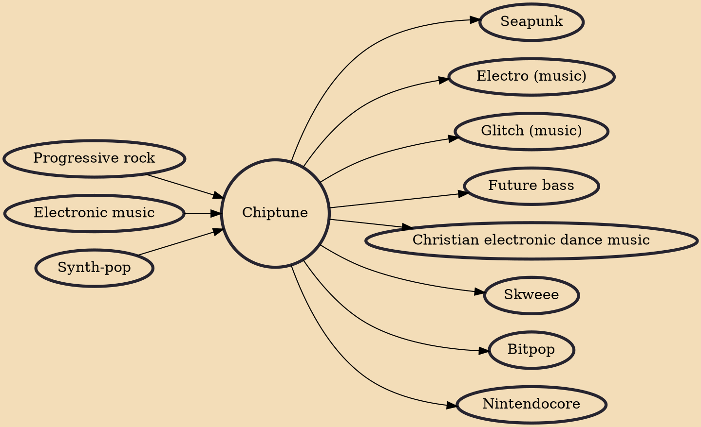

Chiptune, also known as chip music or 8-bit music, is a style of synthesized electronic music made using the programmable sound generator (PSG) sound chips or synthesizers in vintage arcade machines, computers and video game consoles.The term is commonly used to refer to tracker format music which intentionally sounds similar to older PSG-created music (this is the original meaning of the term), as well as music that combines PSG sounds with modern musical styles.It has been described as "an interpretation of many genres" since any existing song can be arranged in a chiptune style defined more by choice of instrument and timbre than specific style elements.

## Influences
- [[Progressive rock]]
- [[Electronic music]]
- [[Synth-pop]]

## Derivatives
- [[Seapunk]]
- [[Electro (music)]]
- [[Glitch (music)]]
- [[Future bass]]
- [[Christian electronic dance music]]
- [[Skweee]]
- [[Bitpop]]
- [[Nintendocore]]
