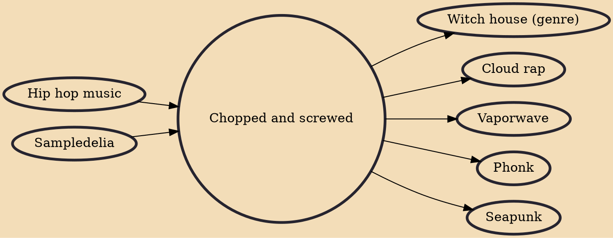

Chopped and screwed (also called screwed and chopped or slowed and throwed) is a music genre and technique of remixing music that involves slowing down the tempo and deejaying. It developed in the Houston hip hop scene in the early 1990s by DJ Screw. The screwed technique involves slowing the tempo of a song down to 60 and 70 quarter-note beats per minute and applying techniques such as skipping beats, record scratching, stop-time and affecting portions of the original composition to create a "chopped-up" version of the song.

## Influences
- [[Hip hop music]]
- [[Sampledelia]]

## Derivatives
- [[Witch house (genre)]]
- [[Cloud rap]]
- [[Vaporwave]]
- [[Phonk]]
- [[Seapunk]]
