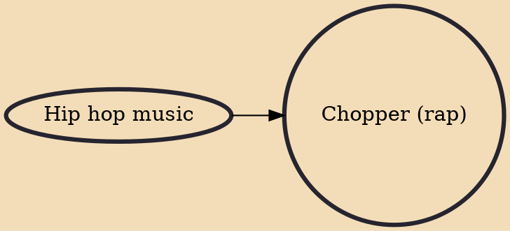

Chopper is a hip hop music subgenre that originated in the Midwestern United States and features fast-paced rhyming or rapping. Those that rap in the style are known as choppers, and rapping in the style is sometimes referred to as chopping. The style is one of the major forms of Midwest hip hop, though by the early 2000s, it had spread to other parts of the United States including California and New York City, and it has spread around the world since.

## Influences

- [[Hip hop music]]
