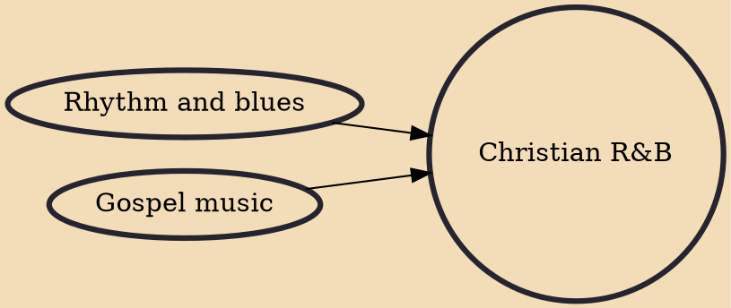

Christian R&B (also known as gospel R&B, rhythm & praise music, and R&P) is a subgenre of rhythm and blues music consisting of tracks with Christian-based lyrics or by musicians typically known for writing such songs. Music in this genre intends to uplift, entertain, or to give a Christian perspective on a topic. Christian R&B could be considered a subgenre of gospel music, or a cross-genre under both gospel and R&B.

## Influences

- [[Rhythm and blues]]
- [[Gospel music]]
