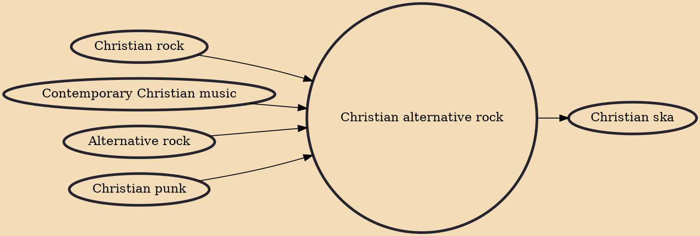

Christian alternative rock is a form of alternative rock music that is lyrically grounded in a Christian worldview. Some critics have suggested that unlike CCM and older Christian rock, Christian alternative rock generally emphasizes musical style over lyrical content as a defining genre characteristic, though the degree to which the faith appears in the music varies from artist to artist.

## Influences
- [[Christian rock]]
- [[Contemporary Christian music]]
- [[Alternative rock]]
- [[Christian punk]]

## Derivatives
- [[Christian ska]]
