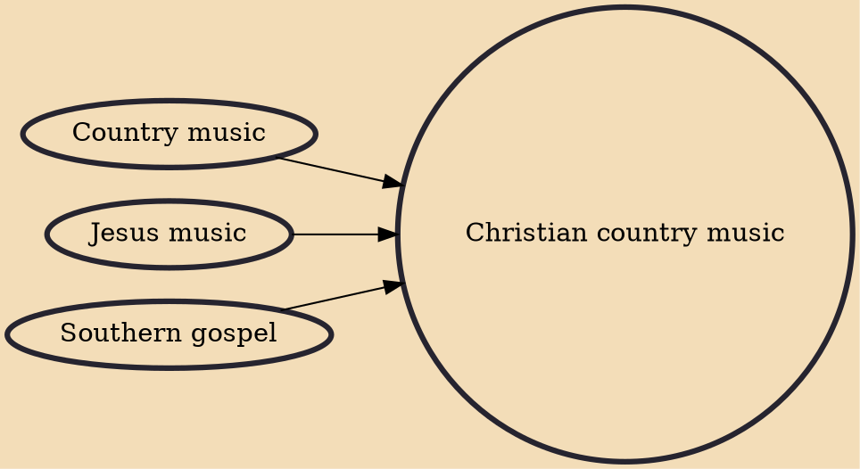

Christian country music (sometimes marketed as country gospel, gospel country, positive country or inspirational country) is music that is written to express either personal or a communal belief regarding Christian life, as well as (in terms of the varying music styles) to give a Christian alternative to mainstream secular music. Christian country music is a form of Christian music and a subgenre of both Gospel music and Country music.

## Influences
- [[Country music]]
- [[Jesus music]]
- [[Southern gospel]]
