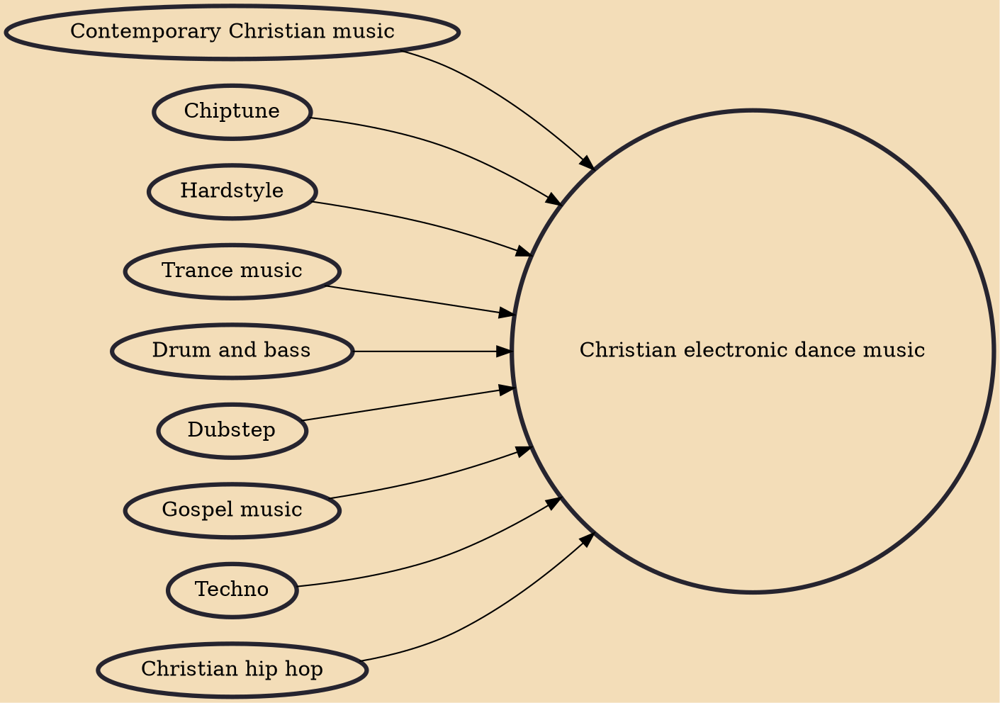

Christian electronic dance music, also known as CEDM, Christian EDM, Christian Dance Music, CDM, or Christian electronic music is a genre of electronic dance music and Christian music. Its musical styles closely mirror non-Christian EDM; however, the CEDM culture's lack of drug use and emphasis of positive lyrics (often focused on Christianity-based principles) distinguish it from non-religious counterparts. EDM.com wrote "the [CEDM] culture can feel quite welcoming." Many live concerts and events have been held in Christian churches in addition to traditional venues such as Lumination, Creation Festival and LifeLight Music Festival. CEDM has also been incorporated into some Christian worship routines.

## Influences

- [[Contemporary Christian music]]
- [[Chiptune]]
- [[Hardstyle]]
- [[Trance music]]
- [[Drum and bass]]
- [[Dubstep]]
- [[Gospel music]]
- [[Techno]]
- [[Christian hip hop]]
