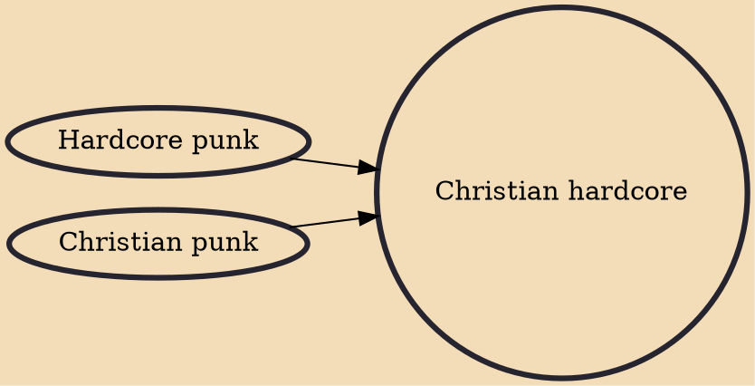

Christian hardcore or Christcore is a subcategory of hardcore punk bands which promote Christian belief. The method and extent of doing so varies between bands. Christian hardcore bands have often openly stated their beliefs and employ Christian imagery in their lyrics, and may be considered a part of the Christian music industry. Fans of Christian hardcore music are not exclusively believers in the Christian religion. Owing to innovation in the hardcore movement such as Extol, Nobody Special, Zao, Living Sacrifice, and the hardcore movement in general, the audience has become less exclusive.

## Influences
- [[Hardcore punk]]
- [[Christian punk]]
