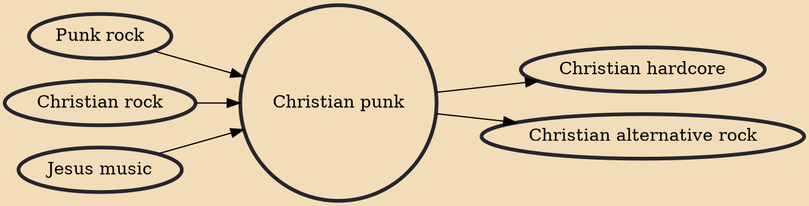

Christian punk is a form of Christian music and a subgenre of punk rock which contain Christian lyrical content. Much disagreement persists about the boundaries of the subgenre, and the extent that their lyrics are explicitly Christian varies among bands. For example, The Crucified explicitly rejected the classification of "Christian punk" while staying within the Christian music industry.

## Influences

- [[Punk rock]]
- [[Christian rock]]
- [[Jesus music]]

## Derivatives

- [[Christian hardcore]]
- [[Christian alternative rock]]
