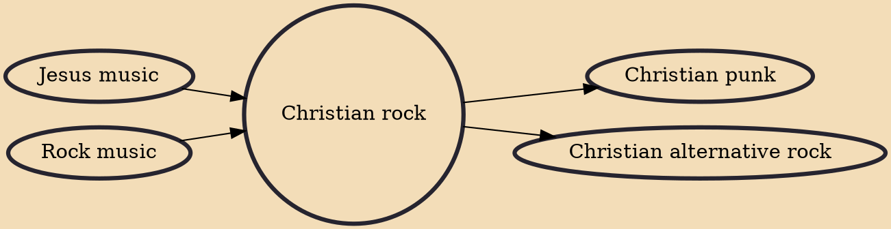

Christian rock is a form of rock music that features lyrics focusing on matters of Christian faith, often with an emphasis on Jesus, typically performed by self-proclaimed Christian individuals. The extent to which their lyrics are explicitly Christian varies between bands. Many bands who perform Christian rock have ties to the contemporary Christian music labels, media outlets, and festivals, while other bands are independent.

## Influences
- [[Jesus music]]
- [[Rock music]]

## Derivatives
- [[Christian punk]]
- [[Christian alternative rock]]
