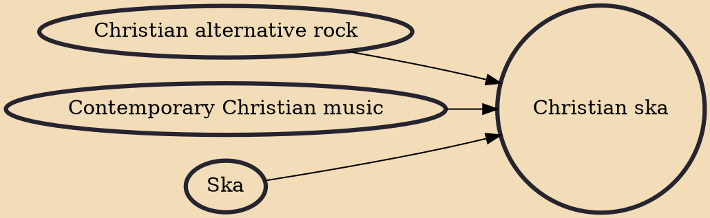

Christian ska is a form of Christian alternative rock, and subgenre of ska and ska punk which is lyrically oriented toward contemporary Christian music. Though ska did not constitute a genre within the Christian music industry until after third wave ska had peaked in the general market, Christian ska continued to thrive independently into the early 2000s.

## Influences
- [[Christian alternative rock]]
- [[Contemporary Christian music]]
- [[Ska]]
