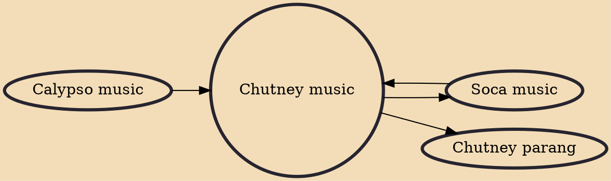

Chutney music is a fusion genre of Indian folk music, specifically Bhojpuri folk music, with local Caribbean calypso and soca music, and later on Bollywood music. This genre of music that developed in Trinidad and Tobago is popular in Trinidad and Tobago, Guyana, Suriname, Jamaica, other parts of the Caribbean, Fiji, Mauritius, and South Africa. Chutney music emerged mid-20th century and reached a peak of popularity during the 1980s. Several sub-genres have developed.

## Influences

- [[Calypso music]]
- [[Soca music]]

## Derivatives

- [[Chutney parang]]
- [[Soca music]]
