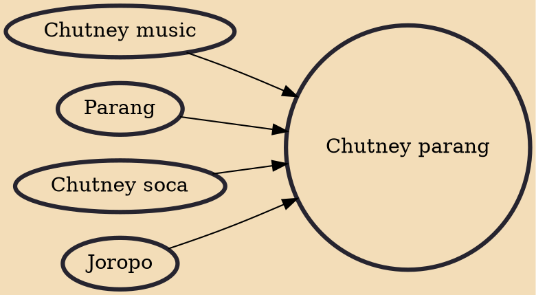

Chutney parang or parang chutney is a style of music that is a cross between Venezuela, Colombia, and Trinidad and Tobago's traditional Christmas music, parang and Indo-Trinidadian chutney music. It is sung in English,Hindustani, and Spanish.

## Influences

- [[Chutney music]]
- [[Parang]]
- [[Chutney soca]]
- [[Joropo]]
