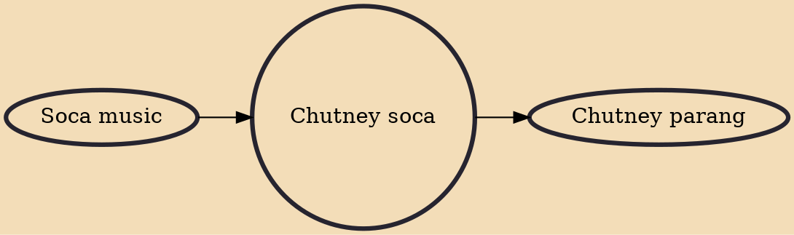

In Trinidad and Tobago, Guyana, and Suriname, chutney soca music is a crossover style of music incorporating soca and calypso elements and English, Hindustani, and Hinglish lyrics, chutney music, with Western instruments such as the guitar, piano, drum set, and Indian instruments such as the dholak, harmonium, tabla, and dhantal.

## Influences

- [[Soca music]]

## Derivatives

- [[Chutney parang]]
