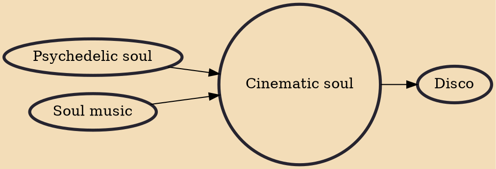

Cinematic soul is a genre of soul music with a "cinematic" style, combining traditional rock / soul arrangements with orchestral instruments.

## Influences
- [[Psychedelic soul]]
- [[Soul music]]

## Derivatives
- [[Disco]]
