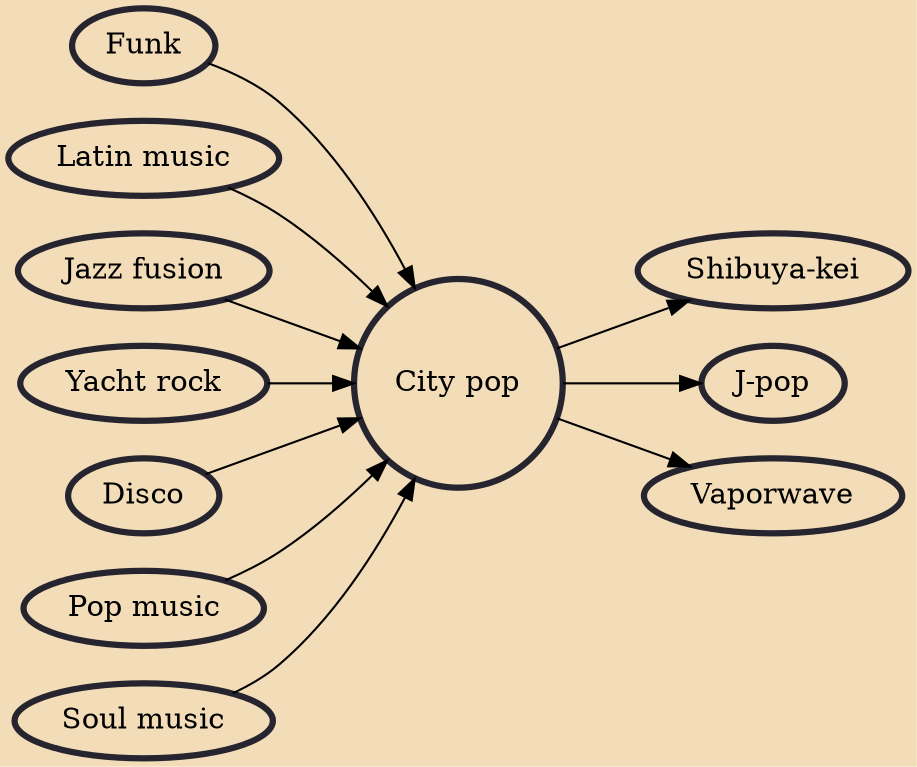

City pop (シティ・ポップ, shiti poppu) is a loosely defined form of Japanese pop music that emerged in the late 1970s and peaked in the 1980s. It was originally termed as an offshoot of Japan's Western-influenced "new music", but came to include a wide range of styles – including AOR, soft rock, R&B, funk, and boogie – that were associated with the country's nascent economic boom and leisure class. It was also identified with new technologies such as the Walkman, cars with built-in cassette decks and FM stereos, and various electronic musical instruments.

## Influences

- [[Funk]]
- [[Latin music]]
- [[Jazz fusion]]
- [[Yacht rock]]
- [[Disco]]
- [[Pop music]]
- [[Soul music]]

## Derivatives

- [[Shibuya-kei]]
- [[J-pop]]
- [[Vaporwave]]
