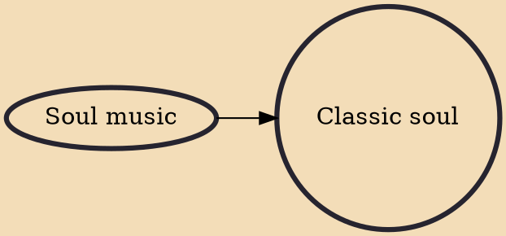

Classic soul is a radio format that focuses on the more raw types of soul music from the 1950s-1970s that draw from certain rhythm and blues and soul music influences, after 1980 is generally considered “contemporary R&B” with the smoother and more sophisticated styles, the split is mostly indicated by Michael Jackson's 1979 album Off the Wall, which is considered to sit at the nexus of disco, funk, pop, soul, classic R&B, and contemporary R&B.

## Influences
- [[Soul music]]
