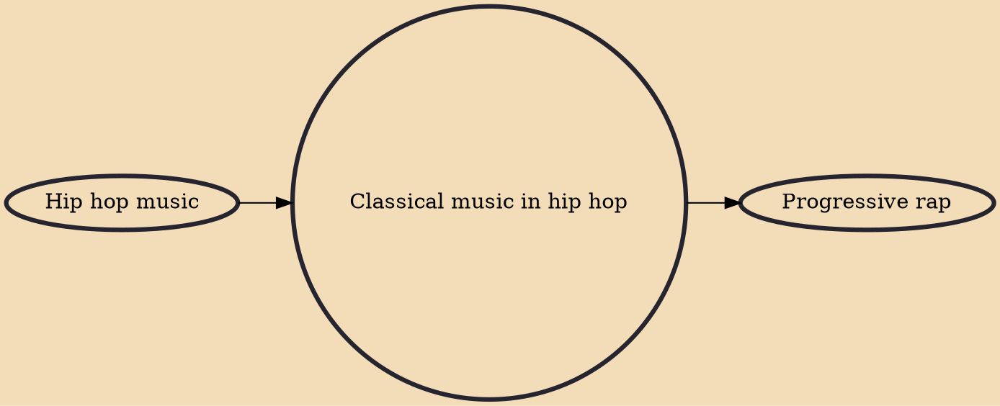

Hip hop music can incorporate elements of classical music, either using live instruments or with recorded samples. Early examples of classical music instrumentation in hip hop date to the 1990s. In the 2000s, artists such as Nas, Kendrick Lamar, The Black Violin, and DJ Premier began to prominently use classical music elements. Classical hip hop's biggest hit so far would be the 2009 Jay-Z and Alicia Keys duet Empire State of Mind, which has been described as an orchestral rap ballad. Post Malone would also flirt with the style as well on some of his songs.

## Influences

- [[Hip hop music]]

## Derivatives

- [[Progressive rap]]
