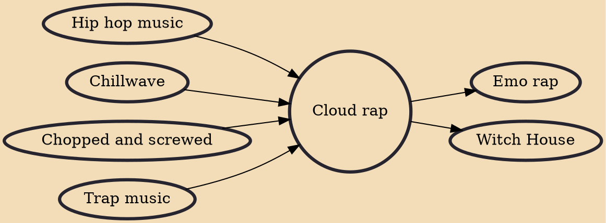

Cloud rap is a subgenre of Southern rap and trap music that has several sonic characteristics of lo-fi in its hazy, dreamlike and relaxed sound. Many music experts credit rapper Lil B and producer Clams Casino as the early pioneers of this style. The term "cloud rap" is related to its internet birth and its ethereal style.

## Influences
- [[Hip hop music]]
- [[Chillwave]]
- [[Chopped and screwed]]
- [[Trap music]]

## Derivatives
- [[Emo rap]]
- [[Witch House]]
