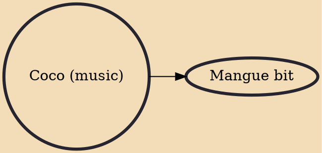

Coco is an African-influenced musical rhythm that originated in northern Brazil. "Coco" may also refer to the style of dance performed to the music, a kind of stomping. Coco is also alternatively known as "embolada" (another slang word, meaning "entangling", referring to the fast, slurred, machine-gun style of singing). Coco is often performed with a repetitive musical beat and call and response singing, reminiscent of Capoeira music. The music is commonly performed at traditional parties in the Northeast, such as weekend street parties and Carnival.

## Derivatives

- [[Mangue bit]]
