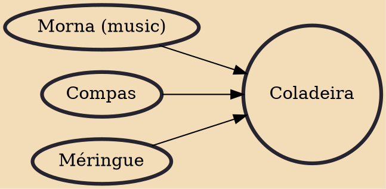

The coladeira (Portuguese pronunciation: [kulɐˈdejɾɐ]; Cape Verdean Creole: koladera, [kolɐˈdeɾɐ]) is a music genre from the Cape Verde islands in the central Atlantic Ocean. It is characterized by a variable tempo, a 2-beat bar, and (in its most traditional form) a harmonic structure based in a cycle of fifths. The lyrics structure is organized in that alternate with a refrain. The tone is generally joyful and themes often include social criticism. Instrumentation typically includes a guitar, a cavaquinho, and percussion, among others.

## Influences

- [[Morna (music)]]
- [[Compas]]
- [[Méringue]]
