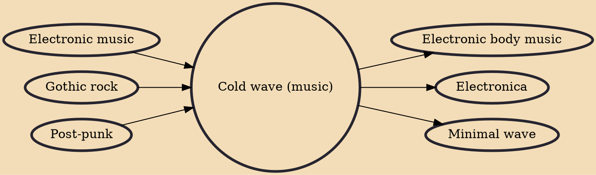

Cold wave is a loosely defined music genre that emerged in Europe in the late 1970s, characterized by its detached lyrical tone, use of early electronic music instruments and a minimalist approach and style. It emerged from punk rock bands who, influenced by early electronic groups such as Kraftwerk, made use of affordable portable synthesizers such as the Korg MS-20. The term can also refer to music otherwise described as "dark wave", "goth", "deathrock", "minimal wave" or "minimal synth".

## Influences

- [[Electronic music]]
- [[Gothic rock]]
- [[Post-punk]]

## Derivatives

- [[Electronic body music]]
- [[Electronica]]
- [[Minimal wave]]
