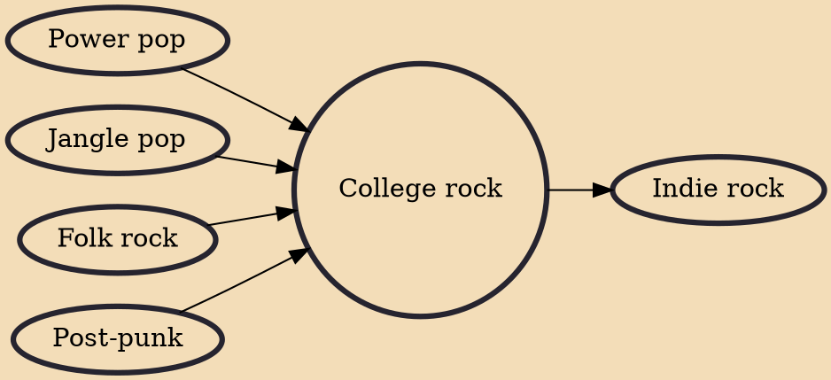

College rock was the alternative rock music played on student-run university and college campus radio stations located in the United States and Canada in the 1980s. The stations' playlists were often created by students who avoided the mainstream rock played on commercial radio stations.

## Influences
- [[Power pop]]
- [[Jangle pop]]
- [[Folk rock]]
- [[Post-punk]]

## Derivatives
- [[Indie rock]]
