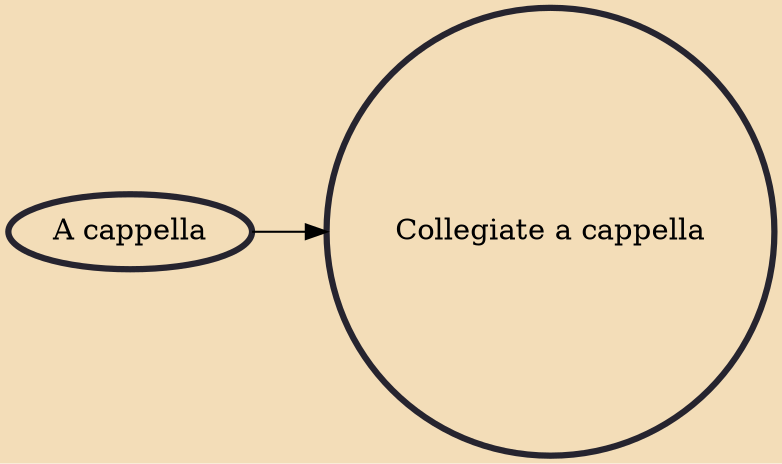

Collegiate a cappella (or college a cappella) ensembles are college-affiliated singing groups, primarily in the United States, and, increasingly, the United Kingdom and Ireland, that perform entirely without musical instruments. The groups are typically composed of, operated by, and directed by students. In the context of collegiate a cappella, the term a cappella typically also refers to the music genre performed by pop-centric student singing groups. Consequently, an ensemble that sings unaccompanied classical music may not be considered an a cappella group, even though technically it is performing a cappella.

## Influences
- [[A cappella]]
