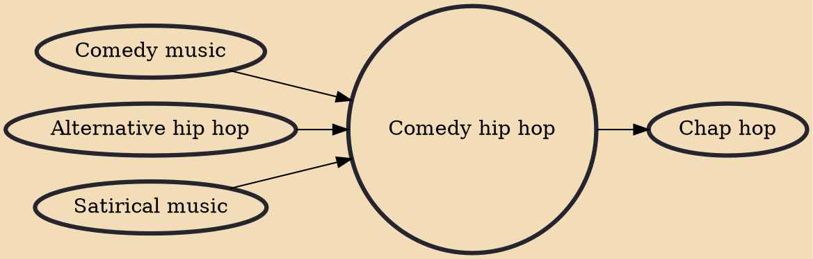

Comedy hip hop or comedy rap, is a subgenre of lighter hip hop music designed to be amusing or funny, compared to artists who incorporate humor into their more serious, purist hip hop styles. Satirical hip hop is a variant of comedy hip hop done in a sarcastic, parodic, deadpan or tongue-in-cheek way. Other forms of comedy rap, such as meme rap and ironic rap, both known for their aggressive and dark comedic approach achieved some mainstream success during the 2000s and 2010s. Many examples of comedy hip hop are parodic.

## Influences

- [[Comedy music]]
- [[Alternative hip hop]]
- [[Satirical music]]

## Derivatives

- [[Chap hop]]
