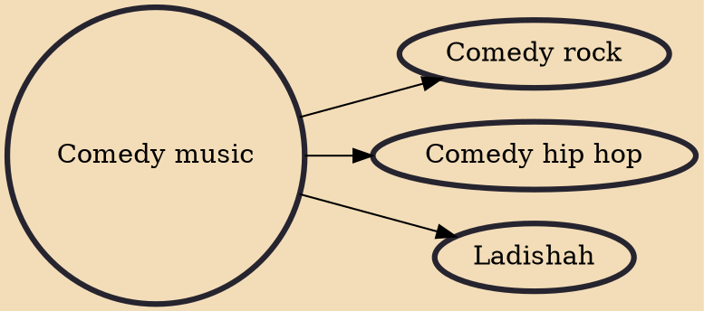

Comedy music or musical comedy is a genre of music that is comic or humorous in nature. Its history can be traced back to the first century in ancient Greece and Rome, moving forward in time to the Medieval Period, Classical and Romantic eras, and the 20th century. Artists in the 20th century include Allan Sherman, Frank Zappa, Tiny Tim, Barenaked Ladies, Randy Newman, and "Weird Al" Yankovic. Artists in the 21st century include Tenacious D, Flight of the Conchords, The Lonely Island, Ninja Sex Party and The Axis of Awesome.

## Derivatives
- [[Comedy rock]]
- [[Comedy hip hop]]
- [[Ladishah]]
