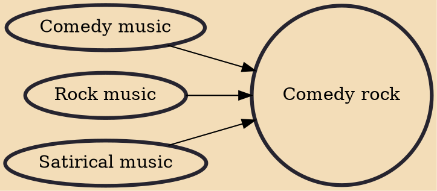

```dot
digraph {
	graph [bgcolor="#F3DDB8" rankdir=LR]
	node [color="#26242F" penwidth=3.0]
	"Comedy rock" [shape=circle]
	"Comedy music" [URL="/comedy-music/"]
	"Comedy music" -> "Comedy rock"
	"Rock music" [URL="/rock-music/"]
	"Rock music" -> "Comedy rock"
	"Satirical music" [URL="/satirical-music/"]
	"Satirical music" -> "Comedy rock"
}
```

Comedy rock is rock music that is comedic in nature. Oftentimes it is mixed with satire or irony.

## Influences

- [[Comedy music]]
- [[Rock music]]
- [[Satirical music]]
