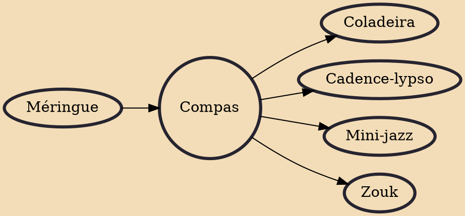

Compas, also known as compas direct or compas direk (French pronunciation: ​[kɔ̃pa]; Haitian Creole: konpa, kompa or kompa dirèk), is a modern méringue dance music genre of Haiti. The genre was popularized following the creation of Ensemble Aux Callebasses in (1955), which became Ensemble Nemours Jean-Baptiste In 1957. The frequent tours of the many Haitian bands have cemented the style in all the Caribbean. Therefore, compas is the main music of several countries such as Dominica and the French Antilles. Whether it is called zouk, where French Antilles artists of Martinique and Guadeloupe have taken it, or compas in places where Haitian artists have toured, this méringue style is influential in part of the Caribbean, Portugal, Cape Verde, France, part of Canada, South and North America.

## Influences

- [[Méringue]]

## Derivatives

- [[Coladeira]]
- [[Cadence-lypso]]
- [[Mini-jazz]]
- [[Zouk]]
