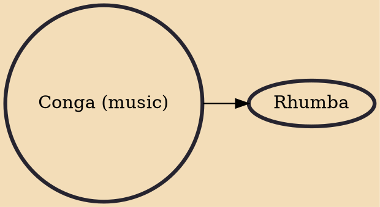

The term conga refers to the music groups within Cuban comparsas and the music they play. Comparsas are large ensembles of musicians, singers and dancers with a specific costume and choreography which perform in the street carnivals of Santiago de Cuba and Havana.

## Derivatives
- [[Rhumba]]
