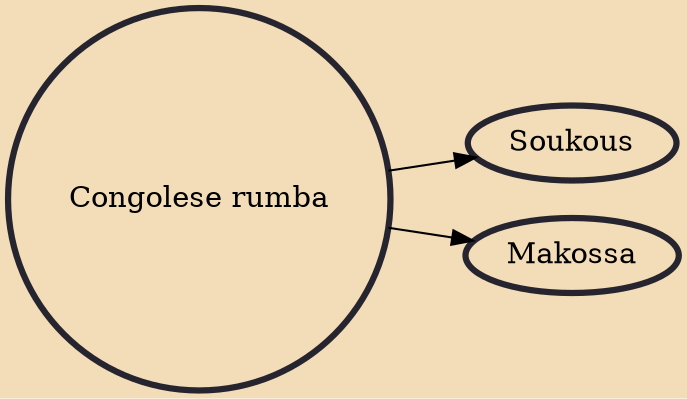

Congolese rumba is a popular genre of dance music that originated in the Congo basin during the 1940s, deriving from Cuban son. The style gained popularity throughout Africa during the 1960s and 1970s. It is known as Lingala in Kenya, Uganda, and Tanzania after the Lingala language of the lyrics in the majority of the songs. In Zambia and Zimbabwe, where Congolese music is also influential, it is still usually referred to as rumba. It is also an individual dance. In December 2021, Congolese rumba was added to the UNESCO list of intangible cultural heritage.

## Derivatives

- [[Soukous]]
- [[Makossa]]
