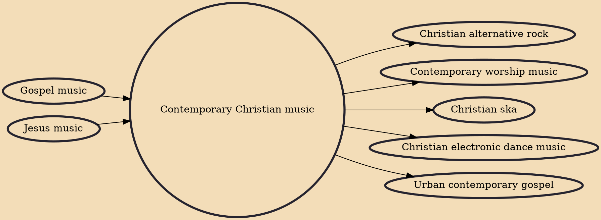

Contemporary Christian music, also known as CCM, Christian pop, and occasionally inspirational music is a genre of modern popular music, and an aspect of Christian media, which is lyrically focused on matters related to the Christian faith and stylistically rooted in Christian music. It was formed by those affected by the 1960s Jesus movement revival who began to express themselves in other styles of popular music, beyond the church music of hymns, gospel and Southern gospel music that was prevalent in the church at the time. Initially referred to as Jesus music, today, the term is typically used to refer to pop, but also includes rock, alternative rock, hip hop, metal, contemporary worship, punk, hardcore punk, latin, EDM, R&B-influenced gospel and country styles.

## Influences

- [[Gospel music]]
- [[Jesus music]]

## Derivatives

- [[Christian alternative rock]]
- [[Contemporary worship music]]
- [[Christian ska]]
- [[Christian electronic dance music]]
- [[Urban contemporary gospel]]
