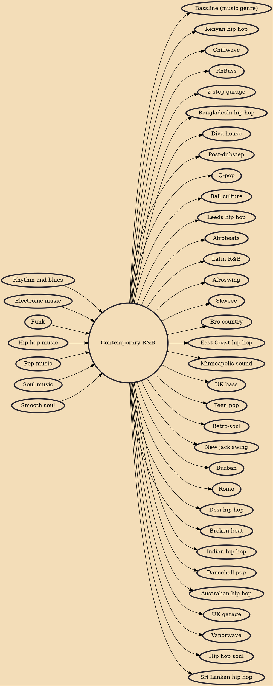

Contemporary R&B (or simply R&B) is a popular music genre that combines rhythm and blues with elements of pop, soul, funk, hip hop, and electronic music. The genre features a distinctive record production style, drum machine-backed rhythms, pitch corrected vocals, and a smooth, lush style of vocal arrangement. Electronic influences are becoming an increasing trend and the use of hip hop or dance-inspired beats are typical, although the roughness and grit inherent in hip hop may be reduced and smoothed out. Contemporary R&B vocalists often use melisma, and since the mid-1980s, R&B rhythms have been combined with elements of hip hop culture and music and pop culture and pop music.

## Influences
- [[Rhythm and blues]]
- [[Electronic music]]
- [[Funk]]
- [[Hip hop music]]
- [[Pop music]]
- [[Soul music]]
- [[Smooth soul]]

## Derivatives
- [[Bassline (music genre)]]
- [[Kenyan hip hop]]
- [[Chillwave]]
- [[RnBass]]
- [[2-step garage]]
- [[Bangladeshi hip hop]]
- [[Diva house]]
- [[Post-dubstep]]
- [[Q-pop]]
- [[Ball culture]]
- [[Leeds hip hop]]
- [[Afrobeats]]
- [[Latin R&B]]
- [[Afroswing]]
- [[Skweee]]
- [[Bro-country]]
- [[East Coast hip hop]]
- [[Minneapolis sound]]
- [[UK bass]]
- [[Teen pop]]
- [[Retro-soul]]
- [[New jack swing]]
- [[Burban]]
- [[Romo]]
- [[Desi hip hop]]
- [[Broken beat]]
- [[Indian hip hop]]
- [[Dancehall pop]]
- [[Australian hip hop]]
- [[UK garage]]
- [[Vaporwave]]
- [[Hip hop soul]]
- [[Sri Lankan hip hop]]
