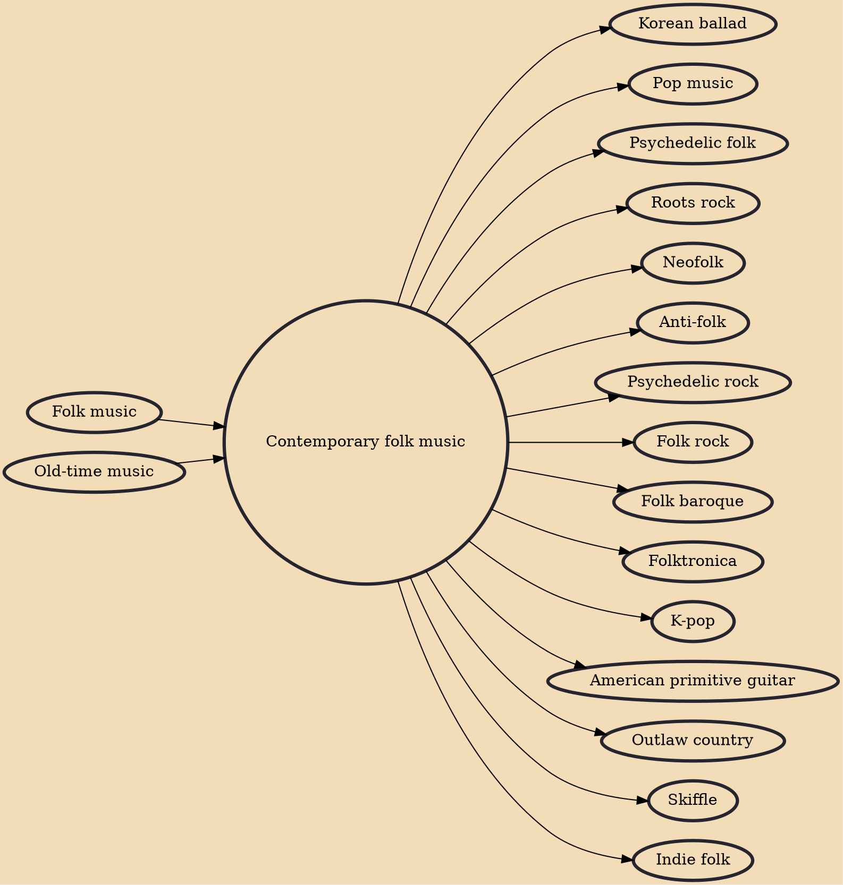

Contemporary folk music refers to a wide variety of genres that emerged in the mid 20th century and afterwards which were associated with traditional folk music. Starting in the mid-20th century a new form of popular folk music evolved from traditional folk music. This process and period is called the (second) folk revival and reached a zenith in the 1960s. The most common name for this new form of music is also "folk music", but is often called "contemporary folk music" or "folk revival music" to make the distinction. The transition was somewhat centered in the US and is also called the American folk music revival. Fusion genres such as folk rock and others also evolved within this phenomenon. While contemporary folk music is a genre generally distinct from traditional folk music, it ofte

## Influences
- [[Folk music]]
- [[Old-time music]]

## Derivatives
- [[Korean ballad]]
- [[Pop music]]
- [[Psychedelic folk]]
- [[Roots rock]]
- [[Neofolk]]
- [[Anti-folk]]
- [[Psychedelic rock]]
- [[Folk rock]]
- [[Folk baroque]]
- [[Folktronica]]
- [[K-pop]]
- [[American primitive guitar]]
- [[Outlaw country]]
- [[Skiffle]]
- [[Indie folk]]
