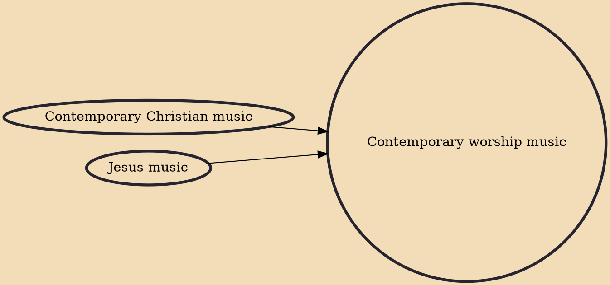

Contemporary worship music (CWM), also known as praise and worship music, is a defined genre of Christian music used in contemporary worship. It has developed over the past 60 years and is stylistically similar to pop music. The songs are frequently referred to as "praise songs" or "worship songs" and are typically led by a "worship band" or "praise team", with either a guitarist or pianist leading. It has become a common genre of music sung in many churches, particularly in charismatic or non-denominational Protestant churches with some Roman Catholic congregations incorporating it into their mass as well.

## Influences
- [[Contemporary Christian music]]
- [[Jesus music]]
