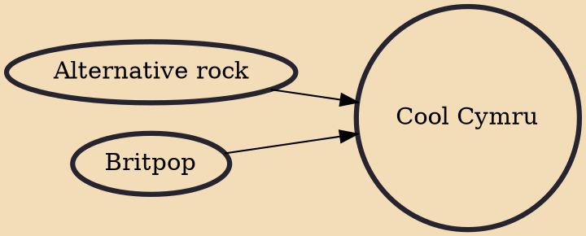

Cool Cymru (Welsh: Cŵl Cymru) was a Welsh cultural movement in music and independent film in the 1990s and 2000s, led by the popularity of bands such as Stereophonics, Gorky's Zygotic Mynci, Manic Street Preachers, Catatonia and Super Furry Animals.

## Influences
- [[Alternative rock]]
- [[Britpop]]
