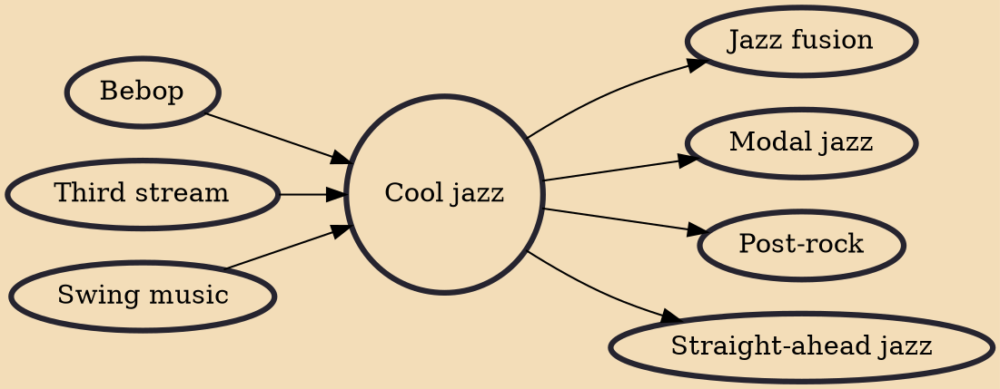

Cool jazz is a style of modern jazz music that arose in the United States after World War II. It is characterized by relaxed tempos and lighter tone, in contrast to the fast and complex bebop style. Cool jazz often employs formal arrangements and incorporates elements of classical music. Broadly, the genre refers to a number of post-war jazz styles employing a more subdued approach than that found in other contemporaneous jazz idioms. As Paul Tanner, Maurice Gerow, and David Megill suggest, "the tonal sonorities of these conservative players could be compared to pastel colors, while the solos of [Dizzy] Gillespie and his followers could be compared to fiery red colors."

## Influences

- [[Bebop]]
- [[Third stream]]
- [[Swing music]]

## Derivatives

- [[Jazz fusion]]
- [[Modal jazz]]
- [[Post-rock]]
- [[Straight-ahead jazz]]
