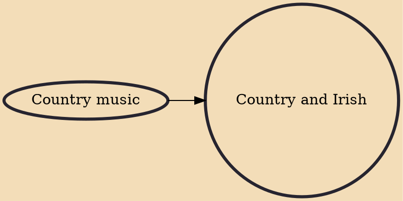

Country and Irish is a musical subgenre in Ireland formed by mixing North American country-style music with Irish influences. It is especially popular in the rural Midlands and North-West of the country, but less so in urban areas or in the South-West where more traditional Irish music is favoured. It also remains popular among Irish emigrants in Great Britain, particularly among the older generation. In a review of the album Round the house and mind the dresser: Irish country house dance music, Vic Gammon observes that the music was partially inspired by a desire for cultural independence.

## Influences
- [[Country music]]
