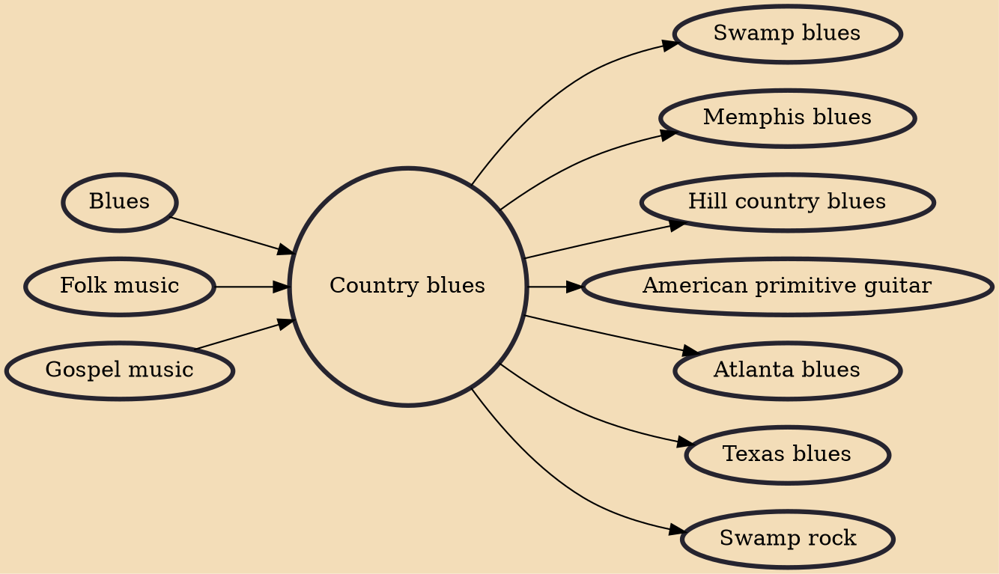

Country blues (also folk blues, rural blues, backwoods blues, or downhome blues) is one of the earliest forms of blues music. The mainly solo vocal with acoustic fingerstyle guitar accompaniment developed in the rural Southern United States in the early 20th century.

## Influences

- [[Blues]]
- [[Folk music]]
- [[Gospel music]]

## Derivatives

- [[Swamp blues]]
- [[Memphis blues]]
- [[Hill country blues]]
- [[American primitive guitar]]
- [[Atlanta blues]]
- [[Texas blues]]
- [[Swamp rock]]
